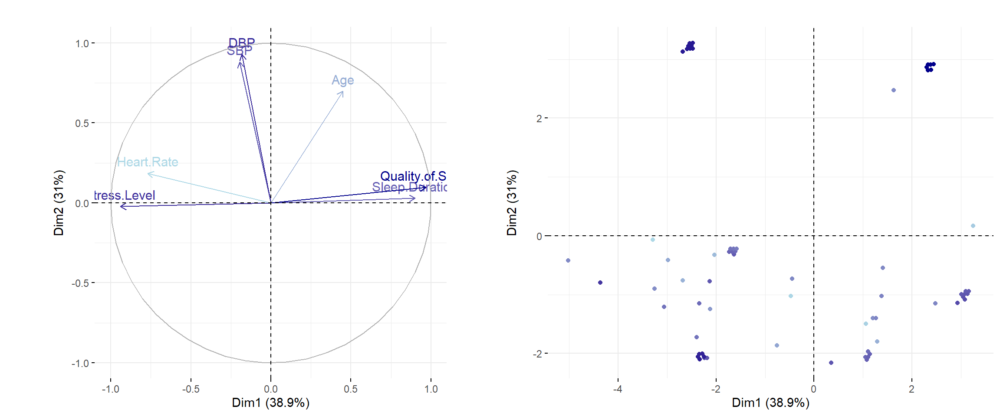

# Sleep Health Multivariate Analysis

## 0. Project Description

This project explores the relationships between **sleep quality**, **health metrics**, and **lifestyle factors** using multivariate statistical methods. The project was developed in the context of the course [LSTAT2110 - Analyse des données](https://uclouvain.be/cours-2024-lstat2110) (UCLouvain, 2024-2025).

The analysis is based on a publicly available dataset (see [Kaggle](https://www.kaggle.com/datasets/uom190346a/sleep-health-and-lifestyle-dataset)). It contains information from 374 individuals including sleep duration, stress levels, blood pressure, BMI, and sleep disorders.

The goal was to gain understanding about the key drivers of sleep quality.

## 1. Repository Structure

- `data/`: Contains the sleep health dataset
- `R/functions.R`: Custom functions for PCA/MCA visualization, quality assessment, and clustering
- `R/analysis.qmd`: Complete analysis workflow with explanations in English
- `R/renv.lock`: Ensures reproducible package versions


## 2. Methodology

The analysis combines three complementary unsupervised learning techniques:

**i. Principal Component Analysis (PCA)**
- Reduces dimensionality from 9 quantitative variables to interpretable components
- Identifies correlation patterns between sleep, stress, and health metrics
- Evaluates representation quality using cos² metrics




**ii. Multiple Correspondence Analysis (MCA)**
- Explores associations between categorical variables (BMI, sleep disorders, blood pressure profiles)
- Reveals clustering of health conditions and sleep patterns


**iii. Hierarchical Clustering + K-means Consolidation**
- Ward's method determines optimal number of clusters (k=4)
- K-means refines partition for maximum between-cluster variance
- Identifies distinct health/sleep profiles in the population


## 3. Installation & Usage

### Prerequisites

- R ≥ 4.0
- RStudio (recommended for Quarto rendering)

### Setup

i. Clone the repository

ii. Restore package dependencies using `renv`
```r
install.packages("renv")
renv::restore()
```

This will install all required packages (`FactoMineR`, `factoextra`, `ggplot2`, `corrplot`, `gridExtra`,etc.) with the exact versions used in the analysis.

iii. Render the analysis
```r
# In RStudio: Open analysis.qmd and click "Render"
# Or from R console:
quarto::quarto_render("analysis.qmd")
```

The output will be a self-contained HTML document with all results, visualizations, and interpretations.